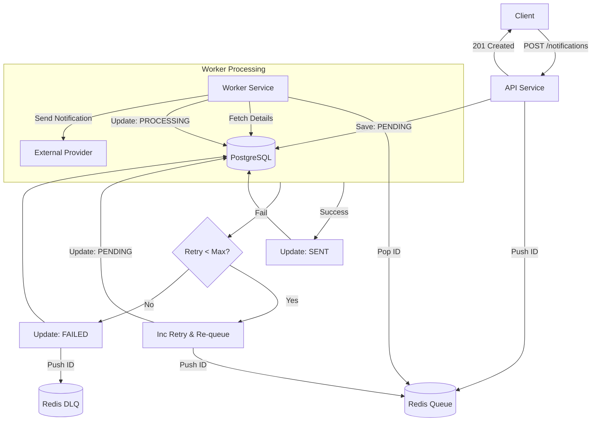
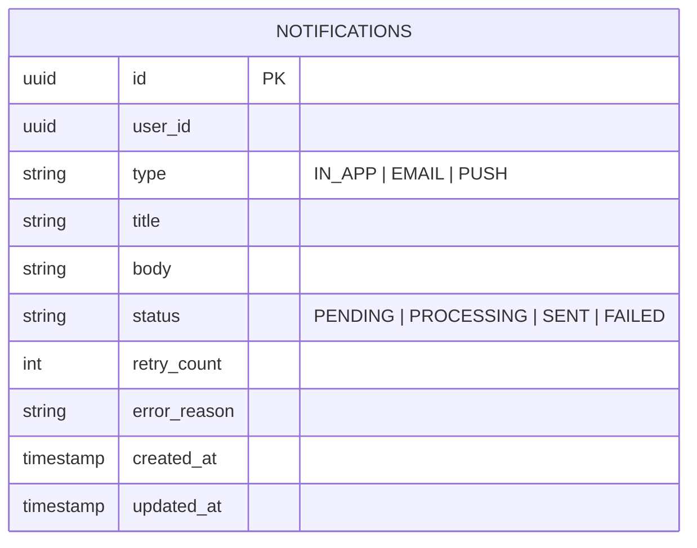
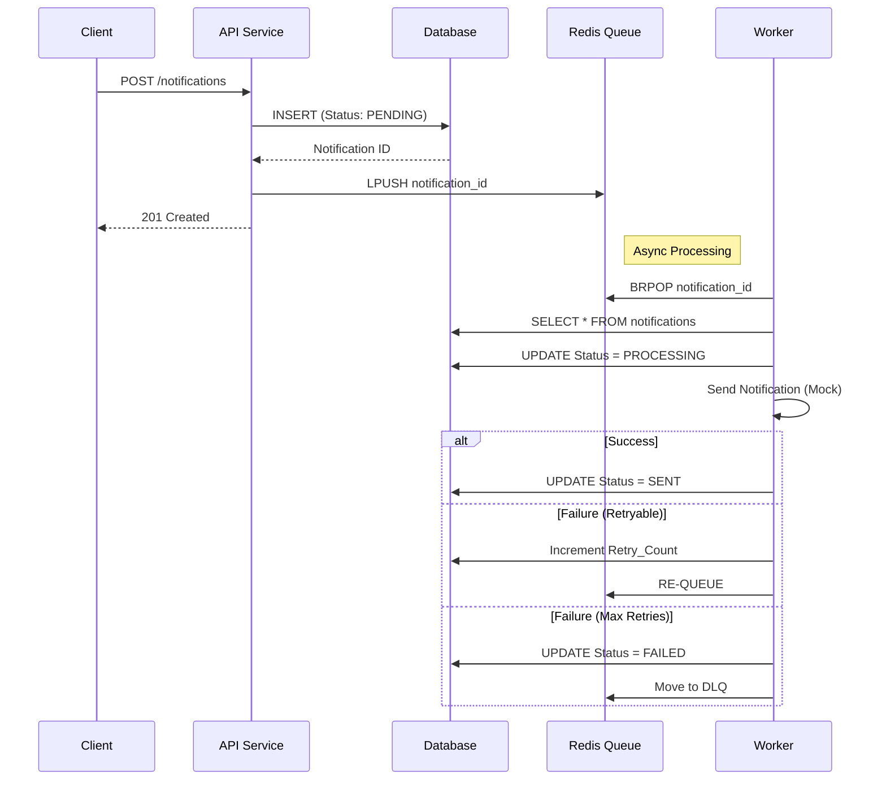

# Notification Service

A robust, scalable notification service built with Go, designed to handle high-throughput notification delivery with retry mechanisms and dead-letter queues.

## Key Features

*   **RESTful API**: Clean HTTP interface for submitting notifications.
*   **Asynchronous Processing**: Non-blocking notification acceptance using Redis queues.
*   **Persistent Storage**: PostgreSQL for reliable notification state tracking.
*   **Reliable Delivery**: Built-in exponential retry mechanism.
*   **Dead Letter Queue (DLQ)**: Automatic handling of failed messages after max retries.
*   **Clean Architecture**: Separation of concerns (Handler, Service, Repository, Queue).

## Tech Stack

*   **Language**: Go (Golang)
*   **Web Framework**: Gin
*   **Database**: PostgreSQL 15 (using `pgx` driver)
*   **Queue**: Redis 7
*   **Containerization**: Docker & Docker Compose

## Architecture

The system follows a producer-consumer pattern decoupled by a Redis queue.



### Project Structure

```bash
├── cmd
│   ├── api                 # API Service entrypoint
│   └── worker              # Background Worker entrypoint
├── internal
│   ├── db                  # Database connection pooling
│   ├── handler             # HTTP Request Handlers (Controller layer)
│   ├── model               # Domain Entities and DTOs
│   ├── queue               # Redis Queue Producer & Client
│   ├── repository          # Data Access Layer (PostgreSQL)
│   └── service             # Business Logic Layer
├── docker-compose.yml      # Local development infrastructure
└── README.md               # You are here
```

## Design Decisions & Trade-offs

### 1. PostgreSQL vs NoSQL
*   **Decision**: We chose **PostgreSQL** over NoSQL (like MongoDB).
*   **Reasoning**: Notifications have a strict lifecycle (`PENDING` -> `PROCESSING` -> `SENT`/`FAILED`). Relational databases provide ACID compliance, ensuring that status updates are atomic and consistent, which is critical for preventing double-sends or lost notifications.

### 2. Redis for Queuing
*   **Decision**: We chose **Redis** Lists (`LPUSH`/`BRPOP`) as a message broker.
*   **Reasoning**: For this scale, Redis offers extremely low latency and sufficient reliability.
*   **Trade-off**: In a massive distributed system with strict ordering guarantees or complex routing, **Kafka** or **RabbitMQ** might be better, but they add significant operational complexity. Redis is a pragmatic choice for high throughput with low overhead.

### 3. Hexagonal / Clean Architecture
*   **Decision**: Separation of `Handler` (Transport), `Service` (Logic), and `Repository` (Data).
*   **Reasoning**: This makes the codebase testable and maintainable. We can easily swap out Gin for Echo or Postgres for MySQL without changing the core business logic.

## Scalability & Reliability

### Horizontal Scaling
*   **Service**: The API service is stateless and can be scaled horizontally behind a Load Balancer to handle increased incoming traffic.
*   **Worker**: Workers can be scaled independently. Since they consume from a shared Redis queue using `BRPOP` (atomic pop), multiple worker instances can run in parallel without processing the same job twice.

### Resilience Patterns
*   **Retry Mechanism**: Transient failures (e.g., 3rd party provider timeout) are handled by re-queuing the notification with an incremented retry count.
*   **Dead Letter Queue (DLQ)**: If a message fails repeatedly (Max Retries), it is moved to a DLQ (`notification_dlq`). This prevents "poison method" loops where a bad message crashes the worker indefinitely.
*   **Connection Pooling**: Uses `pgxpool` for reliable database connection management under load.

## Configuration

The application is configured via Environment Variables (mostly in `docker-compose.yml` for local dev).

| Variable | Description | Default |
| :--- | :--- | :--- |
| `POSTGRES_USER` | DB User | `notif_user` |
| `POSTGRES_PASSWORD` | DB Password | `notif_pass` |
| `POSTGRES_DB` | DB Name | `notification_db` |
| `REDIS_ADDR` | Redis Address | `localhost:6379` |
| `MAX_RETRIES` | Max processing attempts | `3` |

## Data Model

### Notification Schema



## Notification Lifecycle

Sequence of operations for a successful notification delivery.



## API Reference

### Create Notification

**Endpoint**: `POST /notifications`

**Request Body**:
```json
{
  "user_id": "550e8400-e29b-41d4-a716-446655440000",
  "type": "EMAIL",
  "title": "Welcome",
  "body": "Welcome to our service!"
}
```

**Response**:
```json
{
  "message": "notification created"
}
```

## Getting Started

### Prerequisites
*   Docker & Docker Compose
*   Go 1.22+ (optional, for local run without docker)

### Running with Docker Compose

1.  **Start Services**:
    ```bash
    docker-compose up -d
    ```
    This starts Postgres (port 5433), Redis (port 6379).

2.  **Run the API**:
    ```bash
    go run ./cmd/api
    ```
    The server will start on `http://localhost:8080`.

3.  **Run the Worker**:
    ```bash
    go run ./cmd/worker
    ```
    The worker will start listening for jobs.

### Testing

**Submit a Notification**:
```bash
curl -X POST http://localhost:8080/notifications \
  -H "Content-Type: application/json" \
  -d '{
    "user_id": "123e4567-e89b-12d3-a456-426614174000",
    "type": "EMAIL",
    "title": "Hello World",
    "body": "This is a test notification."
  }'
```

**Check Status** (Database):
Connect to Postgres and query the table to see the status change from `PENDING` -> `SENT`.

## Future Improvements

1.  **Authentication**: Add JWT Middleware for `cmd/api`.
2.  **Metrics**: Integrate Prometheus to track `notifications_sent_total` and `queue_latency`.
3.  **Graceful Shutdown**: Handle `SIGTERM` to finish processing active jobs before stopping.
4.  **Integration Testing**: Add `testcontainers` for real DB/Redis tests.
